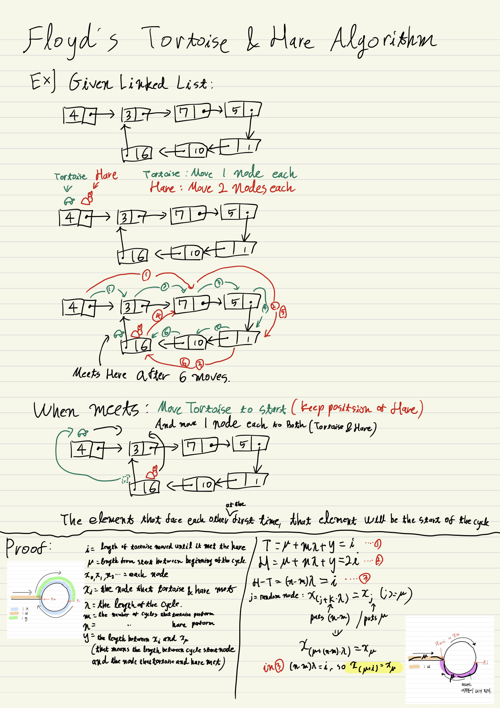

# Code Challenge!

Everyday, 1hour

# Day 1

**Q.** 1000.py like question: find faster method than using <code> a, b = input("").split(" ") </code>

**A.** 
```python
import sys
using_list = list(map(int, sys.stdin.readline().split(" ")))
```

This way will save time (faster than input()) and save the input as integer

# Day 2

Use <code>print(""" ascii art """)</code> to print ascii art.

# Day 3
Name Error in Python: Variable name is not exist <br>
**Example:**
```python
# challenge #2525
import sys

hours, mins = map(int, sys.stdin.readline().split(" "))
remain = int(sys.stdin.readline())

mins = mins + remain
if(mins >= 60): # if this false
    result_mins = mins % 60
    hours = hours + (mins // 60)
    if(hours >= 24):
        hours = hours - 24

print(hours, result_mins) # results_mins does not exist
```

***

Python have <code>max()</code> function. Use it well

# Day 4
You have <code>range(1, n)</code>. If you want to start count from 1, use it.

***

Use <code>.rstrip()</code> to get rid of "\n"<br>
**Example:**
```python
import sys 
num = sys.stdin.readline().rstrip() # if you don't do this, num (str) will have \n
ori = int(num)
if(len(num) == 1):
    num = "0" + num
result = 0
while True:
    tmp = int(num[0]) + int(num[1])
    num = num[1] + str(tmp)[-1]
    result += 1
    if(ori == int(num)): break
print(result)
```

# Day 5

You can implement in one-dimensional list finding duplicate number.

# Day 6

You can use <code>set()</code> to delete duplicate nums. <br>
**Example original code:**
```python
import sys
remain = []
for i in range(10):
    n = int(sys.stdin.readline()) % 42
    if n not in remain:
        remain.append(n)
print(len(remain))
```

instead of using <code>if n not in reamin:</code> <br>
**Example, updated:**
```python
import sys
remain = []
for i in range(10):
    remain.append(int(sys.stdin.readline())%42)
remain = set(remain)
print(len(remain))
```

***

Use <code>print("%.3f" % float_value)</code> to print double/float value with strict decimal places. <br>
Extra places will be rounded. <br>
Integers also prints decimal places. <br>
**Example:**
```python
float_value1 = 0.1234 
float_value2 = 0.5678
int_value = 10

print("%.3f" % float_value1) # prints 0.123
print("%.3f" % float_value2) # prints 0.568; 0.0008 will be rounded
print("%.3f" % int_value) # prints 10.000
```

***

You can use <code>sum()</code> to get sum of the list. <br>
**Example:**
```python
list = [1, 2, 3, 4, 5, 6, 7, 8, 9, 10]
print(sum(list)) # prints 55
```

Moreover, you can use <code>sum(1 for i in range(5))</code> like this. <br>
**Example:**
```python
print(sum(1 for i in range(5))) # prints 5
list = [1, 2, 3, 4, 5, 6, 7, 8, 9, 10]
print(sum(1 for i in list[1:])) # prints 9
```

While apply this in problem #4344: <br>
**Example, Original code**
```python
import sys
cases = int(sys.stdin.readline())
for i in range(cases):
    scores = list(map(int, sys.stdin.readline().split()))
    scores.pop(0)
    sum = 0
    for j in scores:
        sum += j
    avg = sum / len(scores)
    result = 0
    for j in scores:
        if j > avg: result += 1
    print("%.3f%%" % round((result / len(scores)*100), 3))
```
**Example, updated**
```python
import sys
cases = int(sys.stdin.readline())
for i in range(cases):
    scores = list(map(int, sys.stdin.readline().split()))
    avg = sum(scores[1:]) / scores[0] # you can get sum + avg like this
    print("%.3f%%" % (100*sum(1 for i in scores[1:] if i > avg) / case[0])) 
    # sum(1 for i in scores[1:] if i > avg) // in this part, 1 will be added when if ~ is true.
```

# Day 7

Using set() will help you to get rid of duplicate elements of the list. <br> See **Problem #4673** to get more info.

***

Use find() function to find char or string inside of string. <br> find() returns the index if finds, returns -1 if didn't finds. <br> See **Problem #10809** using find()

# Day 8

When you need to find the key that contains biggest value in dictionary, use: <code>max_c = max(dic, key=dic.get)</code> to get the key.

***

You can reverse a string with <code>string[::-1]</code> <br>
**Example:**
```python
s = "python"
s = s[::-1] # inverse a string
print(s) # nohtyp
```

# Day 15

You can use .sort(key=) to specify sort options. <br>
**Example:**
```python
list = ["i", "won", "hesitate", "no", "more"]
list.sort(key=len) # sort by length. not in alphabetical

# You can use lambda in key=
list = [[0, 4], [1, 2], [1, -1], [2, 2], [3, 3]]
list.sort(key= lambda x: (x[1], x[0])) # sort by element x[1]. if x[1] is same, sort by x[0]

import re
list = ("21 Junkyu", "21 Dohyun", "20 Sunyoung")
p = re.compile(r'\d+')
list.sort(key=lambda s: int(p.search(s).group()))
# r'\d+' means return the num in the string. ("+" means longer than 1)
```
To get more info: <a href="https://engineer-mole.tistory.com/271">Click here</a>

# Day 17:

Use .join(list()) to print elements in list<br>
**Example:**
```python
a = ['test', 'text']
print('_'.join(a)) # will print ->test_text
print('\n'.join(a)) 
# will print ->
#test
#text
print('.\n'.join(a))
# will print ->
#test.
#text
```

***

Review needed in problem <a href="BOJ/Day_17/2447.py">2447</a>

# Day 18:

Review need in problem <a href="BOJ/Day_18/11729.py">11729</a>

***

Use <code>import itertools</code> to get combinations or permutations in list<br>
**Example:**

```python
# permutations
from itertools import permutations

for i in permutations([1,2,3,4], 2):
    print(i, end=" ")
'''(1, 2) (1, 3) (1, 4) (2, 1) (2, 3) (2, 4) (3, 1) (3, 2) (3, 4) (4, 1) (4, 2) (4, 3) '''
```

```python
# combinations
from itertools import combinations

for i in combinations([1,2,3,4], 2):
    print(i, end=" ")
'''(1, 2) (1, 3) (1, 4) (2, 3) (2, 4) (3, 4)'''
```

<a href="https://juhee-maeng.tistory.com/91">More Info</a>

# Day 20:

Binary search is useful when the list is sorted. <br>
<a href="BOJ/Day_20/10815.py">More Info</a>

***

set() is more faster than list in containment. <br>
<a href="https://lsh424.tistory.com/59">More Info</a>

# Day 21:

If you want to search dict with values, make a new dict that revsered the key and value. <br>
**Example**
```python
pokedex = {} # orignal. "pokemon name" = key, "pokemon index(num)" = value
rpokedex = {} # reversed
n, m = map(int, stdin.readline().split())
for i in range(1, n+1):
    pokedex[stdin.readline().rstrip()] = i # get input
rpokedex = {v:k for k,v in pokedex.items()} # reversed
rpokedex = dict(map(reversed, pokedex.items())) # alternative
```

***

<code>string.isdecimal</code> is used when judging that input is integer or string. <br>
<a href="https://cotak.tistory.com/137">More Info</a>

# Day 22:

You can rotate list while using deque in collections.<br>
<a href="https://velog.io/@skkumin/Python-deque%EC%82%AC%EC%9A%A9%ED%95%B4%EC%84%9C-%EB%A6%AC%EC%8A%A4%ED%8A%B8-%ED%9A%8C%EC%A0%84%ED%95%98%EA%B8%B0">More Info</a>

# Day 24

```python
from sys import stdin
t = int(stdin.readline())
arr = list(int(stdin.readline()) for i in range(t))
print(*arr)
print(*arr, sep="\n")
```

You can get multiple line input using <code>list(int(stdin.readline()) for i in range(t))</code><br>
And print with <code>print(*arr)</code> to seperate with space. <br> use <code>sep=</code> to change attribute

# Day 27

Difference between .join() and print(*arr, sep=" ")
```python
from sys import stdin
n, m = map(int, stdin.readline().split())
arr = []
def dfs():
    if len(arr) == m:
        print(*arr, sep=" ") # This line
        return
    for i in range(1, n+1):
        if i not in arr:
            arr.append(i)
            dfs()
            arr.pop()
dfs()
# you cannot use .join() in that line because .join() only accepts str. If you want to print integers, use print(*arr, sep=" ")
```

# Day 28

**Need to build python version of 9663 (time exceeded)**

# Day 30

**Make <a href="BOJ/Day_30/14888.py">14888</a> using dfs**

# Day 43

Passed <a href="BOJ/Day_43/11660.py">#11660</a>. <br>
But add zeros at 0-indexs will make the code look easier and shorter.

# Frequent System.out.print~ function call in Java

Frequent print function call can cause time out. <br>
Use **StringBuilder** when needed. <br>
<a href="BOJ/Sliver/S28278.java">Example(#28278)</a>

# Java Stack class

In java.util.Stack, class "Stack" is defined. <br>
use 
```java
Stack<Element> = new Stack<>();
```

# C++ sort() function

In algorithm, sort() function helps sorting vectors. <br>
```c++
sort(vec.begin(), vec.end(), comp)
``` 
You can set sorting order by **comp**. <br>
More info in <a href="BOJ/Sliver/20920.cpp">Example(#20920)</a>